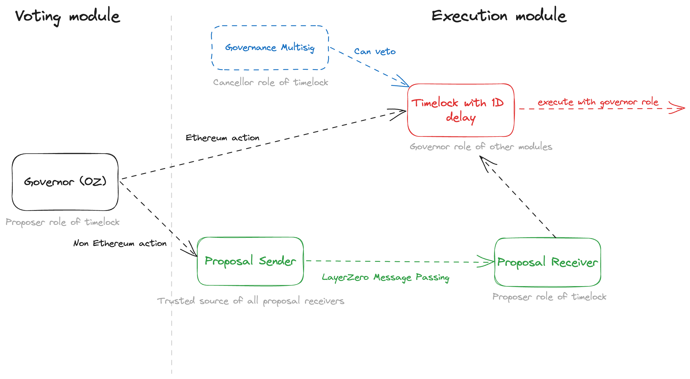

#  Angle Project Boilerplate

[](https://github.com/AngleProtocol/boilerplate/actions)
[](https://codecov.io/gh/AngleProtocol/boilerplate)

## About this repository 🤔

Angle is a decentralized stablecoin protocol, ruled by the [veANGLE token](https://etherscan.io/address/0x0c462dbb9ec8cd1630f1728b2cfd2769d09f0dd5) and natively deployed on multiple EVM compatible chains (including Ethereum, Polygon, Optimism, Arbitrum, ...).

This repository contains the smart contracts for the cross-chain governance system for Angle Protocol relying on LayerZero message passing infrastructure.

It also comes with some utils and scripts to facilitate the creation and execution of proposals on top of the deployed system.

## Simulate a Proposal

- Complete `test/Proposal.sol`
- You can simulate the proposal's execution by running `forge test -vvvv --match-contract Simulate`
- Eventually add tests to `test/Simulate.t.sol`

## System Architecture 🏘️

Angle onchain governance works a ../angle-governance-old/README.md s follows:

- veANGLE holders vote on Ethereum on an OpenZeppelin [`Governor`](contracts/AngleGovernor.sol) implementation called `AngleGovernor` with a predetermined quorum, voting delay and proposal threshold.
- On every chain where the protocol is deployed, there is a `Timelock` contract which is admin of all the protocol contracts (Borrowing module, Transmuter, direct deposit modules, ...) of its chain.
- While only onchain votes can lead to payloads being included in the `Timelock` contract of a chain before execution, [Angle 4/6 Governance multisig](https://docs.angle.money/protocol-governance/angle-dao) (deployed on all chains as well) has a veto power on the payloads in Timelock contracts, and can cancel rogue governance votes.
- For successful votes on non-Ethereum proposals, payloads to execute are bridged to the chain of interest using LayerZero message passing technology before being sent to the `Timelock` contract of their chain.



Precisely speaking, once a vote succeeds (majority of positive votes + quorum), the flow is the following:

- If the vote concerns an Ethereum action:
  - The payload to execute is sent to the Ethereum `Timelock` contract. The Ethereum Timelock contract only accepts payload from the `AngleGovernor` contract
  - After the timelock period ends, if the payload is not veto-ed by [Angle Governance multisig](https://etherscan.io/address/0xdC4e6DFe07EFCa50a197DF15D9200883eF4Eb1c8) on Ethereum, it can be executed on Ethereum.
- If the vote concerns an action on another chain:
  - The payload to execute is sent to a [`ProposalSender`](contracts/ProposalSender.sol) contract on Ethereum which is a simple LayerZero message passing contract owned by the `AngleGovernor` contract.
  - This payload is to be received on the destination chain by a [`ProposalReceiver`](contracts/ProposalReceiver.sol) contract which role is to then send the payload to the Timelock contract of this chain. `Timelock` contracts of non-Ethereum chains only accept payloads from their respective `ProposalReceiver` contract.

It's worth noting that, setup like this, the Angle Governance system can be abstracted among a decision module (`AngleGovernor` contract) and an execution module. Both are modular, and so any could be changed at any time in the future.

---

## Documentation 📚

- [Angle Governance Documentation](https://docs.angle.money/protocol-governance/angle-dao)
- [Angle Documentation](https://docs.angle.money)
- [Angle Developers Documentation](https://developers.angle.money)

---

## Security ⛑️

## Audits

- The `AngleGovernor` implementation relies on several OpenZeppelin extensions as well as on the [audited](http://blog.openzeppelin.com/scopelift-flexible-voting-audit) [`GovernorCountingFractional` extension](https://github.com/ScopeLift/flexible-voting/blob/4399694c1a70d9e236c4c072802bfbe8e4951bf0/src/GovernorCountingFractional.sol) by ScopeLift.
- The [`ProposalReceiver`](contracts/ProposalReceiver.sol) and [`ProposalSender`](contracts/ProposalSender.sol) contracts are forks from LayerZero Labs implementation. Find their audits [here](https://github.com/LayerZero-Labs/omnichain-governance-executor/tree/main/audits).

### Bug Bounty

For contracts deployed for the Angle Protocol, a bug bounty is open on [Immunefi](https://immunefi.com) and [Hats Finance](https://hats.finance). The rewards and scope of the Angle Immunefi are defined [here](https://immunefi.com/bounty/angleprotocol/).

---

## Deployment Addresses 🚦

All Angle governance deployment addresses can be found in the developers documentation [here](https://developers.angle.money/overview/smart-contracts).

---

## Starting

### Install packages

You can install all dependencies by running

```bash
yarn
forge i
```

### Create `.env` file

In order to interact with non local networks, you must create an `.env` that has:

- `PRIVATE_KEY`
- `MNEMONIC`
- network key (eg. `ALCHEMY_NETWORK_KEY`)
- `ETHERSCAN_API_KEY`

For additional keys, you can check the `.env.example` file.

Warning: always keep your confidential information safe.

### Foundry Installation

```bash
curl -L https://foundry.paradigm.xyz | bash

source /root/.zshrc
# or, if you're under bash: source /root/.bashrc

foundryup
```

To install the standard library:

```bash
forge install foundry-rs/forge-std
```

To update libraries:

```bash
forge update
```

### Foundry on Docker 🐳

**If you don’t want to install Rust and Foundry on your computer, you can use Docker**
Image is available here [ghcr.io/foundry-rs/foundry](http://ghcr.io/foundry-rs/foundry).

```bash
docker pull ghcr.io/foundry-rs/foundry
docker tag ghcr.io/foundry-rs/foundry:latest foundry:latest
```

To run the container:

```bash
docker run -it --rm -v $(pwd):/app -w /app foundry sh
```

Then you are inside the container and can run Foundry’s commands.

### Warnings

- Always keep your confidential information safe
- This repository uses [`ffi`](https://book.getfoundry.sh/cheatcodes/ffi) in its test suite. Beware as a malicious actor forking this repo may execute malicious commands on your machine

### Tests

You can run tests as follows:

```bash
forge test -vvvv --watch
forge test -vvvv --match-path contracts/forge-tests/KeeperMulticall.t.sol
forge test -vvvv --match-test "testAbc*"
forge test -vvvv --fork-url https://eth-mainnet.alchemyapi.io/v2/Lc7oIGYeL_QvInzI0Wiu_pOZZDEKBrdf
```

You can also list tests:

```bash
forge test --list
forge test --list --json --match-test "testXXX*"
```

### Deploying

There is an example script in the `scripts/foundry` folder. Then you can run:

```bash
yarn foundry:deploy <FILE_NAME> --rpc-url <NETWORK_NAME>
```

Example:

```bash
yarn foundry:deploy scripts/foundry/DeployMockAgEUR.s.sol --rpc-url goerli
```

### Coverage

We recommend the use of this [vscode extension](ryanluker.vscode-coverage-gutters).

```bash
yarn coverage
```

You'll need to install lcov `brew install lcov` to visualize the coverage report.

---

### Gas report ⛽️

```bash
yarn gas
```

---

## Contributing

If you're interested in contributing, please see our [contributions guidelines](./CONTRIBUTING.md).

---

## Questions & Feedback

For any question or feedback you can send an email to [contact@angle.money](mailto:contact@angle.money). Don't hesitate to reach out on [Twitter](https://twitter.com/AngleProtocol)🐦 as well.

---

## License

This repository is released under the [MIT License](LICENSE).


## Media

Don't hesitate to reach out on [Twitter](https://twitter.com/AngleProtocol) 🐦
